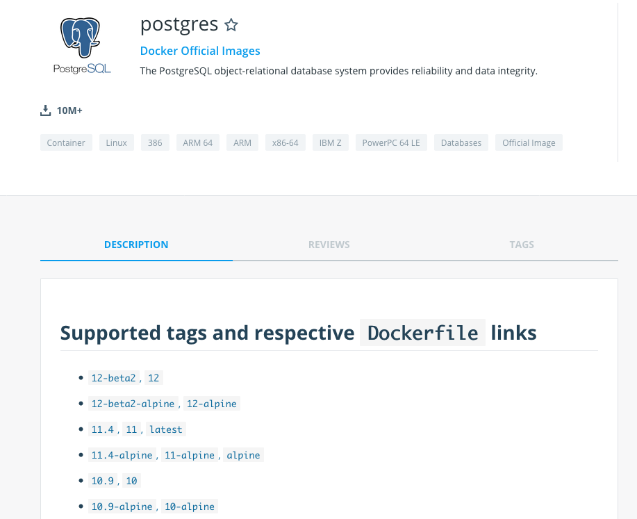

:customcss: css/custom.css

[state=title]
= CD on Kubernetes that scale
Bjarte Stien Karlsen & Kristoffer Moberg Christensen
2019-09-14
:revnumber: {project-version}

//Kristoffer
[.image-slide]
== [.underline]#*CRITICAL VULNERABILITY*# out that affects all your images.

[.credit]
credit:foobar

[state=red-font]
== Intro
* Kristoffer Moberg Christensen, Trainee in the Norwegian Tax Administration(NTA)
* Bjarte Stien Karlsen, Architect & Developer in NTA

// Bjarte
== Demo1
 * Show simple asciicinema demo

// Kristoffer
== Agenda
* *Background*
* Sprocket
* Future plans

== Background
 * Running OpenShift since 2015
 * Semantic Version based version strategy
 * BuildConfig, CustomBuilder and triggers for building
 * Scheduled ImageStreams for Continous Delivery (CD)

== Our clusters
* 6 stable-clusters
* 120 nodes
* 5500 pods
* on-prem OpenShift 3.11

[.left-box]
[.image-slide]
== Semantic version

[.credit]
credit:https://hub.docker.com/_/postgres (screenshost)

== Postgres strategy
[#strategies]
|===
|Name | Description
|latest |Any new build
|9 |New features and patches
|9.6 | New patches
|9.6.14 | locked
|===
 * alpine classifier

== What is missing?
 * what is the base image when no classifier
 * what version of the base image is used
 * what if the build logic changes

// Bjarte
== Aurora Version
plantuml::versionStrategy.puml["versionStrategy", png]

== Build
plantuml::buildConfig.puml["buildConfig1", png]

== BaseImage Change
plantuml::buildConfig2.puml["buildConfig2", png]

== Code change
plantuml::buildConfig3.puml["buildConfig3", png]

== Update
plantuml::imageStream.puml["imageStream", png]

== New base image
plantuml::imageStream1.puml["imageStream1", png]

// Kristoffer
== Problem #1: Performance
Polling for new changes to lots of images all the time does not scale

== Problem #2: Race condition on multiple triggers
If a Pod has two containers and both have new versions who triggers first?

== Problem #3: No flow control
Updating the base image/builder will fire every single build at the same time

== Needs
 * push based, reacting to events/webhooks
 * support Nexus (hosted/grouped repos)
 * support OpenShift resources
 * enable flow control
 * rate limiting

== Can OpenSource help?
 * looked at a lot of alternatives
 * most are based on polling
 * most promising is https://keel.sh/docs/#introduction[keel]
 ** supports WebHook/push based
 ** does not support OpenShift resources
 ** does not support Nexus Container Registry
 ** no flow control

== What primitives can help us here?
 * notifications from DockerRegistries
 * notifications from build pipelines
 * labels on resources enable efficient queries
 * label values have limitations, so sha1 the content.
 * CRD are possible to complex workflow/configuration

== Build our own
 * No OpenSource solution so we decided to build our own based on notifications from Nexus Container Registry notifications
 * Current solution ties us to OpenShift

// Bjarte
== Agenda
* Background
* *Sprocket*
* Future plans

[state=left-box]
== Sprocket

[.credit]
credit:https://barkpost.com/cute/the-best-muppet-dogs/

[state=red-font]
== Sprocket
plantuml::sprocket.puml["sprocket", png]

== Sprocket
* multiple instances
* leader election
* all instance are nodes but only a single leader

== Node
plantuml::sprocket-flowcontrol-node.puml["sprocket-flowcontrol-node", png]

== Resources
plantuml::sprocket-flow.puml["sprocket-flow", png]

== Leader
plantuml::sprocket-flowcontrol-leader.puml["sprocket-flowcontrol-leader", png]

// Sprocket-1.1, Sprocket-1.2
// Sprokcet-1.1: har noen lease? NEI. jeg tar lease og starter prosessene
// Builds: count=2, sleep=30s
// Deploy: count=2, sleep=10s
// R1: app1, app2, app3
// State: app1, app2, app3
// Process runs with app1 and app2, lease in db: now+2min
// State: app3
// R2: app1, app4, app3 (persist app1, app4, app3, men også hva som legges i køen?)
// State: app3, app1, app4,
// Process runs with app3 and app1, lease in db: now+2min
// State: app4
// Process runs with app3 and app1, lease in db: now+2min
// deploy Sprocket 2
// Sprocket-2.1: Har noen lease Ja.
// Sprocket-2.2: Har noen lease? Nei.
// Sprocket-1.1: dør
// Sprocket-1.2: dør
// R3 -> Sprocket-2.2: har noen lease? Nei? Okai jeg tar den.

== Limitations
 * no resilience if event fails
 ** we get an alert from Nexus but nothing automatic
 *

== Use cases
 * Can you just start to use it?
 * It depends on how you build and version images
 * MVP support Nexus Container Registry and ImageStreams

== Version Strategy
plantuml::versionStrategy.puml["versionStrategy", png]

== Use Sprocket for rolling out "patches"
 * you rebuild an existing tag when there is a "bug"
 * usage pattern:
 ** install sprocket in your cluster
 ** configure Nexus Docker Registry global event hook
 ** label you resources

== Agenda
* Background
* Sprocket
* Use cases
* *Future plans*

== Plan: Expand resources
- Deployment
- BuildConfig
- Sprocket CRD for 1-to-many semantics
-- utdype alle disse

== Plan: Rate limit and flow control
- Enable configuration of rate limit in sprocket
- All changes from a single ImageChangeEvent will be flow controlled
- Ensure that a single ImageChangeEvent does not fire multiple rollouts of the same resource

== Plan: Audit log
 - Make an audit log of ImageChangeEvents for observability
 - splunk

== Plan: Cache Manifest
 * on an ImageChangeEvent cache part of the Manifest for internal use in developer tools

== Plan: Fallback loop
 * Sometimes events will fail
 * Create a fallback loop that will periodically check if everything is up to date
 ** fire a ImageChangeEvent if not up to date

== Plan: Support multiple clusters
 - distribute the ImageChangeEvent to multiple clusters
 - option: write to multiple master apis?
 - option: kafka?

== Plan: Tekton
 - Can tekton be used to enable complex workflows?
 - Make a ImageChangeEvent something that fires a tekton pipeline

