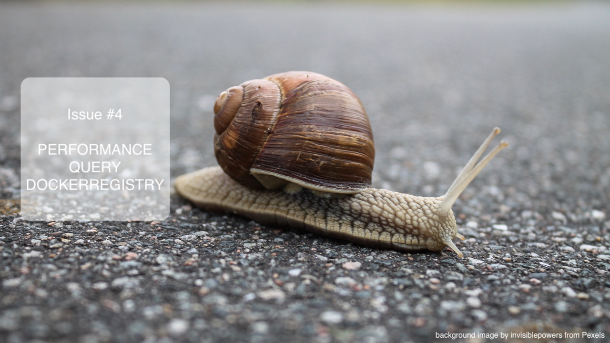
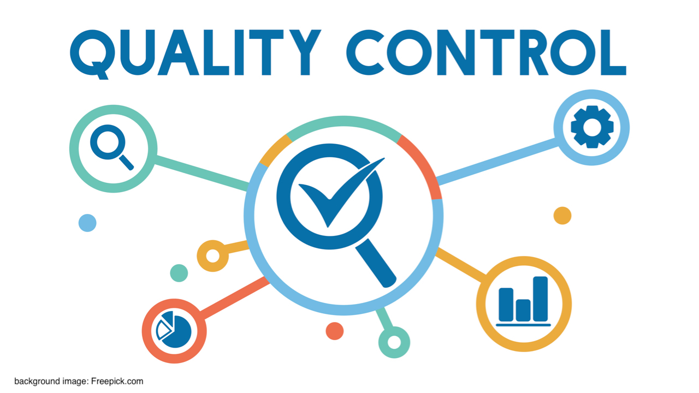

= CD on Kubernetes that scale
Bjarte Stien Karlsen & Kristoffer Moberg Christensen
2019-09-14
:revnumber: {project-version}

== !
image::images/security-bug.jpg[canvas, size=cover]

[.notes]
--
* Kris comes on stages and says: Critical vulnerability out
* Affects all images
* React now
* Bjarte: Do you have the processes and tools in place to handle this scenario?
* Stay in this talk to learn how we are building a tool to help us tackle this scenario
* After you leave you will be equiped with more knowledge and maybe a tool that can help you?
--

== Intro
* Kristoffer Moberg Christensen, Trainee in the Norwegian Tax Administration(NTA)
* Bjarte Stien Karlsen, Architect & Developer in NTA @bjartek

[.notes]
--
* Kris: Eariler this year I interned at Bjartes team where I worked on this problem
* If you want to know more about Trainee/Tech Graduate program, come to stand after
* Bjarte: Developer and Architect working mainly on PaaS.
* Last year at JavaZone presented about our experience, we have a problem and hence we are here
--

== MVP demo
 * https://asciinema.org/a/265939

[.notes]
--
* Start build to simulate that CVE is fixed
* Nothing happends
* Ensure sprocket is running
* Label imageStream
* Start deploy, it is rolled out
* Transision Kris: Before we talk more about us, why we created a tool and why not opensource
--

== Agenda
* *Skatteetaten(NTA) and Kubernetes*
* Status quo and problems?
* Needs and requirements
* Sprocket MVP
* Sprocket 1.0

[.notes]
--
* Us and Kubernetes in order to understand the scope
* Summarize the findings and problems Bjarte reported last year
* Discuss what needs and requirements we have for a new sollution
* Present details about the MVP that we demoed earlier
* Discuss planed features for Sprocket 1.0
* Transision: If you have questions...
--

== Questions?
* Time at the end for questions
* Or come to our stand, we will both be there after the talk

[.notes]
--
* Transition Bjarte : how do NTA run kubernetes?
--

== PaaS in NTA
 * Running OpenShift distribution since 2015
 * Semantic Version based version strategy
 * BuildConfig, CustomBuilder and triggers for building
 * Scheduled ImageStreams for Continuous Delivery (CD)

[.notes]
--
* brief
--

== Clusters
* 6 stable-clusters
* 120 nodes
* 5500 pods
* on-prem OpenShift 3.11
* 50% annual growth

[.notes]
--
* Transition Kristoffer: Before we talk about CI and CD we need to talk about versioning, plays important part
--

== !
image::images/postgres.png[postgres, size=cover]

[.notes]
--
* common pattern
* one digest of an Docker Image has multiple tags
* tags can be overwritten
* Transision: This enables certain deployment strategies in your CD pipeline
--

== Postgres strategy
[#strategies]
|===
|Name   | Description
|latest | latest or newest stable?
|9      | New features and patches
|9.6    | New patches
|9.6.14 | New when base image changes
|===

[.notes]
--
* is latest newest build or newest stable build?
* all these tags point to same digest
* briefly talk about the different strategies
* think about the contract for this application in this deployment
* Transision: But there are some missing information here.
--

== !
image::images/postgres_baseimage.png[postgres_baseimage, size=cover]

[.notes]
--
* what base image is the standard one?
* it might be in metadata, but why not as tag?
--

== !
image::images/postgres_baseimage_version.png[postgres_baseversion, size=cover]

[.notes]
--
* alpine classifier shows the base image name, but what about version?
--

== !
image::images/postgres_builder_logic.png[postgres_builder, size=cover]

[.notes]
--
* Where does the builder logic change? Does it? Can i rebuild old image?
* Most applicable if you have centralized builder logic like we do
* transition to Bjarte: So how do we create tags?
--

== !
plantuml::versionStrategy.puml["versionStrategy", png]

[.notes]
--
* latest is always newest semantic version
* Extra tag that clearly show all the parts of a version
* central component of our CI and CD pipelines
* Transition: How does this affect building images
--

== !
plantuml::buildConfig.puml["buildConfig1", png]

== !
plantuml::buildConfig2.puml["buildConfig2", png]

== !
plantuml::buildConfig3.puml["buildConfig3", png]

[.notes]
--
* Transition Kris: So when this is built how does applications get updated in our current CD pipeline
--

== !
plantuml::imageStream.puml["imageStream", png]

== !
plantuml::imageStream1.puml["imageStream1", png]

[.notes]
--
 * Transition to Bjarte There are some issues with a CD pipeline
--

== !

[.notes]
--
    * Bjarte
    * Our installation has few and large clusters and does not scale
    * Polling is not optimal
--

== !
image::images/overflow.jpg[canvas, size=cover]

[.notes]
--

* Kris
* The builtin flow control in Kubernetes and Openshift does not meet our needs
    * We want to have more control of how images are built and deployed
    * Currently rebuilding a base image will fire every single build until kubernetes cluster reaches its resource limits
--

== !
image::images/locked.jpg[canvas, size=cover]

[.notes]
--
* Bjarte
* Want to use kubernetes resources
* We want to be _able_ to use another distribution
* Lots of other advantages of OpenShift
* Easier to test AuroraPlattform on top of other distributions
--

== !

[.notes]
--
* kris
* we parse manifest and extract some information in our own Console
* docker api for fetching tags manifests is not fast
* we cache part of manifest and tag list
* need to invalidate
--

== !

[.notes]
--
 * bjarte
 * contact notary before rollout in some environments
 * ask for approval from a chat user
 * culture demands it for certain projects/applications
 * audit trail
 * transition Kris:  Based on our current CI/CD pipeline and the issues we have seen what is the needs for an improved solution
--

== Needs
 * push based, reacting to events/webhooks
 * support Nexus Docker Registry(hosted/grouped repos)
 * support OpenShift resources and vanilla kubernetes
 * enable flow control/rate limiting
 * support quality control
 ** chatops
 ** notary
 * react to changed images to update caches

== Can OpenSource help?
 * looked at a lot of alternatives
 * most are based on polling
 * most promising is https://keel.sh/docs/#introduction[keel]
 ** supports WebHook/push based
 ** does not support OpenShift resources
 ** does not support Nexus Container Registry
 ** no flow control

[.notes]
--
* transition Bjarte: So no OpenSource solution can be used, what did we do?
--

== !
image::images/sprocket.jpg[canvas, size=cover]

[.notes]
--
 * Fraggle rock inspiration
--

== !
plantuml::sprocket-mvp.puml["sprocket-mvp", png]

[.notes]
--
* We started of building an MVP to test out the concept
* We authenticate and parse events from Nexus into ImageChangeEvents
* Fetch AffectedResources from the cluster
* And update the running applications
* Transistion: scope of MVP
--

== MVP scope
* Only supports Nexus Container Registry global event hook
* Only works in the cluster you deploy it in with ImageStreams
* You need to build the Docker Image yourself

[.notes]
--
* Started out with a very narrow scope
* transition Kris: What steps are needed to start using it?
--

== Installation steps
* Build the sprocket docker image
* Configure global event hook in your Nexus Container Registry
* Set up and configure sprocket
** Shared secret from Nexus
** RBAC: list, update, create ImageStreams
* Start sprocket

== Usage
* Update your ImageStream
** Remove scheduling
** Label with skatteetaten.no/sprocket=sha1-<sha1 digest of pull url>

== Lessons
* Push based model is very snappy compared to pulling
** As seen in the demo
* Nexus Container Registry
** HMAC security is not straight forward
** Filtering and washing events is complicated
* Need fallback loop when events fails

[.notes]
--
* transition Bjarte: This is as far as we are right now, but we have many plans for 1.0
--

== !
[.single-headline2]
Sprocket 1.0

== Features
 * Support other input sources then Nexus
 * Hooks (onUpdate, onImageChangeEvent)
 * Support multiple clusters/resources
 * Optional approval via ChatOps
 * Flow-control
 * Quality assurance from notary
 * Fallback loop for handling missing events
 * Management api

[.notes]
--
* transition: So how does the details looks like
--

== !
plantuml::sprocket-parsing.puml["sprocket-parsing", png]

[.notes]
--
* Support more input sources
** Docker registry
** cloud events
* hook to send events to other services
** invalidate manifest cache/tag cache
* transition to Kris: After ImageChangeEvents are parsed and stored how do we find resources?
--

== !
plantuml::sprocket-fetching.puml["sprocket-fetching", png]

[.notes]
--
* An AffectedResource is put into the ResourceQueue unless:
* It is already in the queue waiting to be processed
* It required approval from one or more roles
* Need approval since culture wants it for prod
* Avoid duplicate rollouts shortly after each other
* Transition to Bjarte: What kind of resources do we plan to support
--

== !
plantuml::sprocket-resources.puml["sprocket-resources", png]

[.notes]
--
--

== !
plantuml::sprocket-crd.puml["sprocket-crd", png]

[.notes]
--
* Sprocket CRD is used for 1-many
* 1 BuildConfig needs to react to both changes in Builder logic and Base Image
--

== !
plantuml::sprocket-flowcontrol-leader.puml["sprocket-flowcontrol-leader", png]

[.notes]
--
* leader-election, only a single instance reads from queue
* each partition of the ResourceQueue has it own applier job
* onUpdate hook for audit trail
* Will avoid DDoS of Docker Registry
* to Kris: But what about the AffectedImages that requires approvals?
--

== !
plantuml::sprocket-management.puml["sprocket-management", png]

[.notes]
--
*  transition to Bjarte: So what about the all important fallback loop
--

== Fallback loop
* Sometimes events will fail
* Periodically
** Fetch all unique sprockets
** Find latest ImageChangeEvent for sprocket
** Compare digest in ImageChangeEvent to digest in registry for the same tag
** If changed create a new ImageChangeEvent and send to Sprocket

[.notes]
--
*  transition to Kris: So what about the management interface
--

== Management
* Approve/reject an AffectedResource
* Manage the ResourceQueue
* Reporting
* Runtime configuration

[.notes]
--
* Loose plans
* transition to Bjarte: So what can we take from this.
--

== Conclusion
 - Create tools and processes to automate CD
 - Prefer push based model
 - Create fallback pull based loops for resiliency

== Question?
- Do you have any questions?
- Have alternate ways of doing this? Please reach out to us and we can talk!

== Fin
 - https://github.com/skatteetaten/sprocket
 - https://skatteetaten.github.io/aurora/
 - Come to our stand to talk more!
 - We are hiring!
 - We hope to release Sprocket to a Docker Registry near you later this year.

