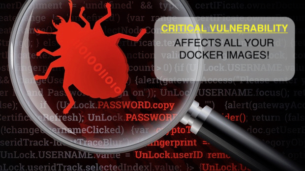
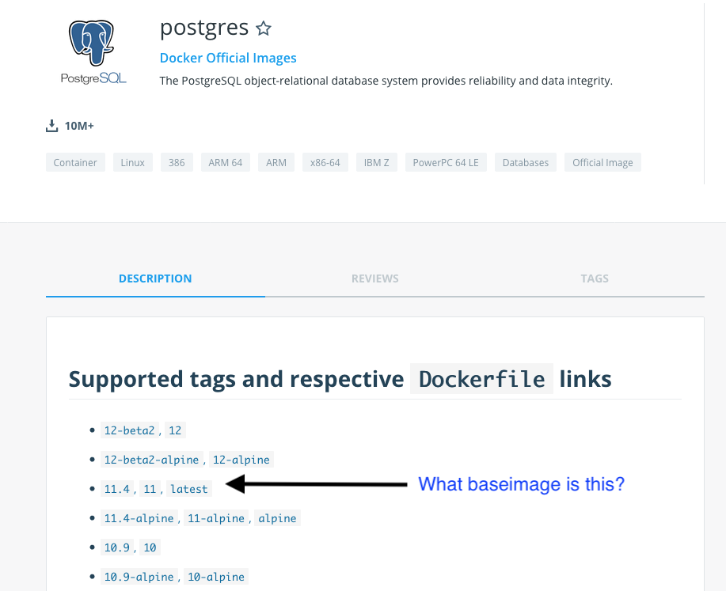
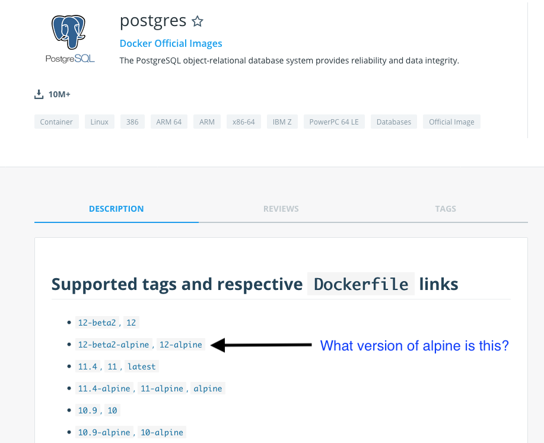
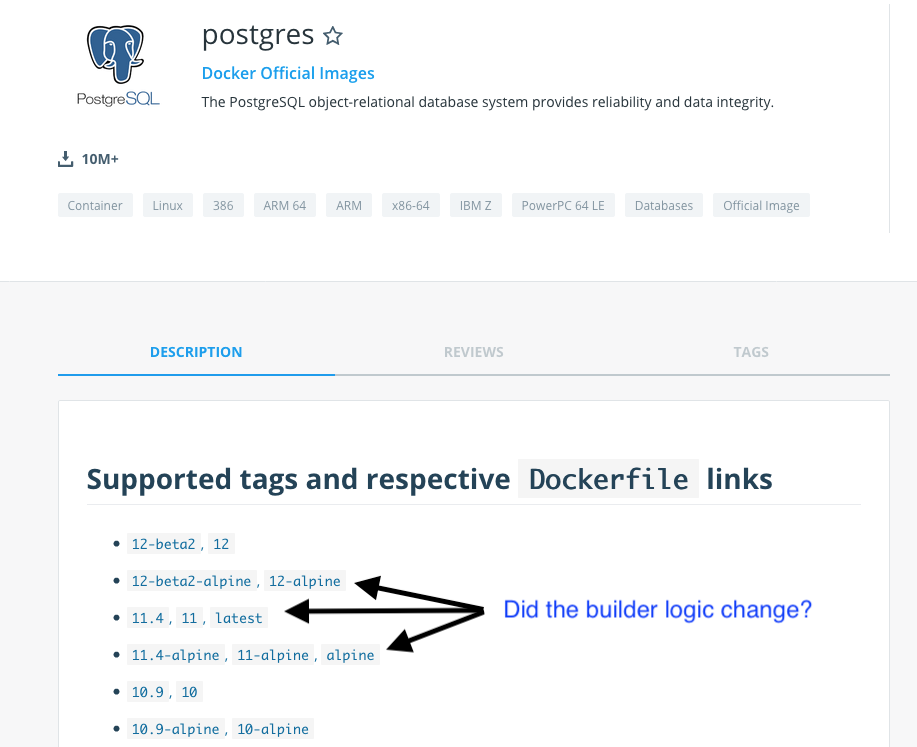
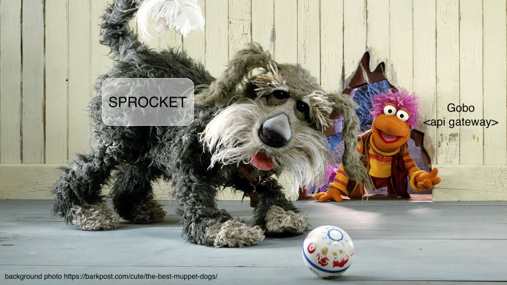

:customcss: css/custom.css

[state=title]
= CD on Kubernetes that scale
Bjarte Stien Karlsen & Kristoffer Moberg Christensen
2019-09-14
:revnumber: {project-version}

//Kristoffer
[.image-slide]
== [.underline]#*CRITICAL VULNERABILITY*# out that affects all your images.

[.credit]
credit:foobar

// Gjør denne dramatisk

// 1:     a1b
// 1.2:   a1b
// 1.2.3: a1b*
// test:  a1b
// prod:  c5k

//tagge test -> prod
// <siste patch>> --> test

//Tag: foo/bar:1@a1b -> foo/bar: prod
//Nytt base image foo/bar:1@c2k : prod@a1b

// Hard kobling mellom CI (jenkins?) og hvilke miljøer som skal ha ny versjon?

//== We can help
// * Install Sprocket and configure it for listening to Deployments in your cluster
// * Set up Nexus global event hook to send events to Sprocket
// * label your Deployment with the sprocket label
// * build new image
// * new ReplicaSet will be rolled out

[state=red-font]
== Intro
* Kristoffer Moberg Christensen, Trainee in the Norwegian Tax Administration(NTA)
* Bjarte Stien Karlsen, Architect & Developer in NTA

// Bjarte
== Sprocket MVP demo
* Show simple asciicinema demo
// run build, nothing happens?

//Sprocket is running
//Show configuration
//label resource

// run build, it works

== Questions?
* Time at the end for questions
* Or come to our stand, we will both be there after the talk

// Agenda
== Agenda
* *Skatteetaten(NTA) and Kubernetes*
* Status quo and problems?
* Needs and requirements
* Sprocket MVP
* Sprocket 1.0

== PaaS in NTA
 * Running OpenShift since 2015
 * Semantic Version based version strategy
 * BuildConfig, CustomBuilder and triggers for building
 * Scheduled ImageStreams for Continuous Delivery (CD)

== Our clusters
* 6 stable-clusters
* 120 nodes
* 5500 pods
* on-prem OpenShift 3.11

//Kristoffer

== !
image::images/postgres.png[postgres, size=cover]

== Postgres strategy
[#strategies]
|===
|Name   | Description
|latest | Any new build
|9      | New features and patches
|9.6    | New patches
|9.6.14 | New when base image changes/builder
|===

== !

== !

== !

// Bjarte
== Aurora Version
plantuml::versionStrategy.puml["versionStrategy", png]

== Current CD pipeline

== Build
plantuml::buildConfig.puml["buildConfig1", png]

== BaseImage Change
plantuml::buildConfig2.puml["buildConfig2", png]

== Code change
plantuml::buildConfig3.puml["buildConfig3", png]

// Kristoffer
== Update
plantuml::imageStream.puml["imageStream", png]

== New base image
plantuml::imageStream1.puml["imageStream1", png]

== Issue #1: Performance
Polling for new changes to lots of images all the time does not scale. Reported last javaZone.

== Issue #2: No flow control
Updating the base image/builder will fire every single build at the same time

== Issue #3: OpenShift
Current solution ties us to OpenShift

// 10 min
// Headline

// Bjarte
== Needs
 * push based, reacting to events/webhooks
 * support Nexus (hosted/grouped repos)
 * support OpenShift resources
 * enable flow control
 * rate limiting

== Can OpenSource help?
 * looked at a lot of alternatives
 * most are based on polling
 * most promising is https://keel.sh/docs/#introduction[keel]
 ** supports WebHook/push based
 ** does not support OpenShift resources
 ** does not support Nexus Container Registry
 ** no flow control

== What primitives can help us here?
 * notifications from DockerRegistries
 * labels on resources enable efficient queries
 * label values have limitations, so sha1 the content.
 * CRD are possible to complex workflow/configuration

== Build our own
 * No OpenSource solution so we decided to build our own based on notifications from Nexus Container Registry notifications

[state=left-box]
== Sprocket

[.credit]
credit:https://barkpost.com/cute/the-best-muppet-dogs/

== Requirements
* Only supports Nexus Container Registry
* Only imageStreams supported in MVP
* You need to build the Docker Image yourself
* Sprocket needs to be able to communicate with all master-apis
* It depends on how you build and version images

== Version Strategy
plantuml::versionStrategy.puml["versionStrategy", png]

== !
image::images/postgres.png[postgres, size=cover]

== Installation steps
* Build the sprocket docker image
* configure global event hook in your Nexus Container Registry
* set up and configure sprocket with shared secret from Nexus
* configure clusters/resources and permissions in your clusters
* Start sprocket

== Label the resources
* Update your kubernetes manifests to include skatteetate.no/sprocket labels
* Or update some resources manually to test it out

[state=red-font]
== Design
plantuml::sprocket.puml["sprocket", png]

== Resources
plantuml::sprocket-flow.puml["sprocket-flow", png]

== One to many
- Builds trigger both on base image and builder logic
- Deployments can have multiple pods/init-containers

== Sprocket
* multiple instances
* leader election
* all instance are nodes but only a single leader

// Bjarte
== Node
plantuml::sprocket-flowcontrol-node.puml["sprocket-flowcontrol-node", png]

== Leader
plantuml::sprocket-flowcontrol-leader.puml["sprocket-flowcontrol-leader", png]

== Management
* approve/reject an AffectedImage
* manage ResourceQueue and the related Runners
* manage imageChangeEvent hook
* manage fallback loop

== ResourceFilterer
* An AffectedResource is put into the ResourceQueue unless:
** It is already in the queue waiting to be processed
** It required approval from one or more roles

== ResourceQueue
 * Partitioned on Builds/Deploys for each cluster
 * Will be rate limited according to configuration
 * Each partition can be started/stopped in management api

== Hooks
 * On imageChangeEvent/onUpdate fire a webhook to an endpoint
 * for invalidating manifest cache or tag list cache
 ** nexus does not perform well for fetching tags/manifests

== Fallback loop
* Sometimes events will fail
* Periodically check for outdated resource
** fire a ImageChangeEvent if not up to date

== Support CloudEvents
- for supporting different events then nexus
- send event when your base distribution base image changes (ubi/alpine)

// 10 min
// Konklusjonslide

== Conclusion
 - Create tools and processes to automate CD
 - Prefer push based model
 - Crate fallback pull based loops for resiliency

== Fin
 - https://github.com/skatteetaten/sprocket
 - https://skatteetaten.github.io/aurora/
 - Come to our stand to talk more!
 - We hope to release Sprocket to a Docker Registry near you later this year.

