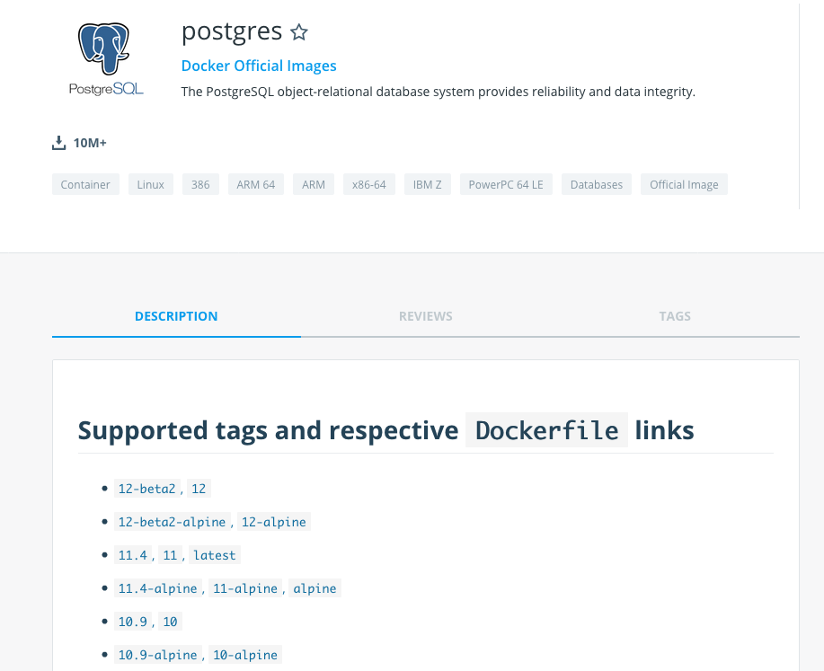

:customcss: css/custom.css

[state=title]
= CD on Kubernetes that scale
Bjarte Stien Karlsen & Kristoffer Moberg Christensen
2019-09-14
:revnumber: {project-version}

//Kristoffer
[.image-slide]
== [.underline]#*CRITICAL VULNERABILITY*# out that affects all your images.

[.credit]
credit:foobar

// 1:     a1b
// 1.2:   a1b
// 1.2.3: a1b*
// test:  a1b
// prod:  c5k

//tagge test -> prod
// <siste patch>> --> test

Tag: foo/bar:1@a1b -> foo/bar: prod
Nytt base image foo/bar:1@c2k : prod@a1b

// Hard kobling mellom CI (jenkins?) og hvilke miljøer som skal ha ny versjon?

// Bjarte
== Demo1
* Show simple asciicinema demo

[state=red-font]
== Intro
* Kristoffer Moberg Christensen, Trainee in the Norwegian Tax Administration(NTA)
* Bjarte Stien Karlsen, Architect & Developer in NTA

== Questions?
* Time at the end for questions
* Or come to our stand, we will both be there after the talk

// 5 min

== Agenda
* *Skatteetaten(NTA) and Kubernetes*
* Our old CD pipeline
* Needs for CD pipeline
* Introducing Sprocket
* How to use Sprocket
* Future plans

== PaaS in NTA
 * Running OpenShift since 2015
 * Semantic Version based version strategy
 * BuildConfig, CustomBuilder and triggers for building
 * Scheduled ImageStreams for Continuous Delivery (CD)

== Our clusters
* 6 stable-clusters
* 120 nodes
* 5500 pods
* on-prem OpenShift 3.11

//Kristoffer
[.left-box]
[.image-slide]
== Semantic version

[.credit]
credit:https://hub.docker.com/_/postgres (screenshost)

== Postgres strategy
[#strategies]
|===
|Name | Description
|latest |Any new build
|9 |New features and patches
|9.6 | New patches
|9.6.14 | locked
|===
 * alpine classifier

== What is missing?
 * what is the base image when no classifier
 * what version of the base image is used
 * what if the build logic changes

// 5 min

== Agenda
* Skatteetaten(NTA) and Kubernetes
* *Our old CD pipeline*
* Needs for CD pipeline
* Introducing Sprocket
* How to use Sprocket
* Future plans

// Bjarte
== Aurora Version
plantuml::versionStrategy.puml["versionStrategy", png]

== Build
plantuml::buildConfig.puml["buildConfig1", png]

== BaseImage Change
plantuml::buildConfig2.puml["buildConfig2", png]

== Code change
plantuml::buildConfig3.puml["buildConfig3", png]

// Kristoffer
== Update
plantuml::imageStream.puml["imageStream", png]

== New base image
plantuml::imageStream1.puml["imageStream1", png]

== Issue #1: Performance
Polling for new changes to lots of images all the time does not scale. Reported last javaZone.

== Issue #2: Race condition on multiple triggers
If a Pod has two containers and both have new versions who triggers first?

== Issue #3: No flow control
Updating the base image/builder will fire every single build at the same time

== Issue #4: OpenShift
Current solution ties us to OpenShift

// 10 min

== Agenda
* Skatteetaten(NTA) and Kubernetes
* Our old CD pipeline
* *Needs for CD pipeline*
* Introducing Sprocket
* How to use Sprocket
* Future plans

// Bjarte
== Needs
 * push based, reacting to events/webhooks
 * support Nexus (hosted/grouped repos)
 * support OpenShift resources
 * enable flow control
 * rate limiting

== Can OpenSource help?
 * looked at a lot of alternatives
 * most are based on polling
 * most promising is https://keel.sh/docs/#introduction[keel]
 ** supports WebHook/push based
 ** does not support OpenShift resources
 ** does not support Nexus Container Registry
 ** no flow control

== What primitives can help us here?
 * notifications from DockerRegistries
 * labels on resources enable efficient queries
 * label values have limitations, so sha1 the content.
 * CRD are possible to complex workflow/configuration

== Build our own
 * No OpenSource solution so we decided to build our own based on notifications from Nexus Container Registry notifications
 * Current solution ties us to OpenShift

// 5 min

// Kristoffer
== Agenda
* Skatteetaten(NTA) and Kubernetes
* Our old CD pipeline
* Needs for CD pipeline
* *Introducing Sprocket*
* How to use Sprocket
* Future plans

[state=left-box]
== Sprocket
image::images/sprocket.jpg[canvas, size=cover]
[.credit]
credit:https://barkpost.com/cute/the-best-muppet-dogs/

[state=red-font]
== Sprocket
plantuml::sprocket.puml["sprocket", png]

== Sprocket
* multiple instances
* leader election
* all instance are nodes but only a single leader

// Bjarte
== Node
plantuml::sprocket-flowcontrol-node.puml["sprocket-flowcontrol-node", png]

== Leader
plantuml::sprocket-flowcontrol-leader.puml["sprocket-flowcontrol-leader", png]

== Resources
plantuml::sprocket-flow.puml["sprocket-flow", png]

== One to many
 - Builds trigger both on base image and builder logic
 - Deployments can have multiple pods/init-containers

// Kristoffer
== Missing pieces
 * no resilience if event fails
 ** we get an alert from Nexus but nothing automatic

// 10 min

// Kan jeg bruke det nå?
// Hva må jeg gjøre for å ta det i bruk?
== Agenda
* Skatteetaten(NTA) and Kubernetes
* Our old CD pipeline
* Needs for CD pipeline
* Introducing Sprocket
* *How to use Sprocket*
* Future plans

== Use cases
 * Can you just start to use it?
 * It depends on how you build and version images
 * MVP support Nexus Container Registry and ImageStreams

== Version Strategy
plantuml::versionStrategy.puml["versionStrategy", png]

== Use Sprocket for rolling out "patches"
 * you rebuild an existing tag when there is a "bug"
 * usage pattern:
 ** install sprocket in your cluster
 ** configure Nexus Docker Registry global event hook
 ** label you resources

// 5 min

== Agenda
* Skatteetaten(NTA) and Kubernetes
* Our old CD pipeline
* Needs for CD pipeline
* Introducing Sprocket
* How to use Sprocket
* *Future plans*

== Support CloudEvents
 - for supporting different events then nexus

== Management
 - api to view what is in the queue
 - ability to pause an runner
 - ability to change runner parameters
 -- bulk size
 -- delay
 - approvals? (before tagging a prod docker tag require approval)

== Cache Manifest
 * invalidate cache of tags if there is a new tag
 * invalidate manifest cache if tag changed

== Fallback loop
 * Sometimes events will fail
 * Create a fallback loop that will periodically check if everything is up to date
 ** fire a ImageChangeEvent if not up to date

== Tekton
 - Can tekton be used to enable complex workflows?
 - Make a ImageChangeEvent something that fires a tekton pipeline

== Testing
 - When releasing a new base image you want to ensure that it does not impose any regressions.
 - When there is an ImageChangeEvent for a base image start a manual tekton pipeline to test it first before addings elements to the queue?

== Approval alerts to slack/mattermost
 - when a sprocket CRD fires that require approval

// 10 min
